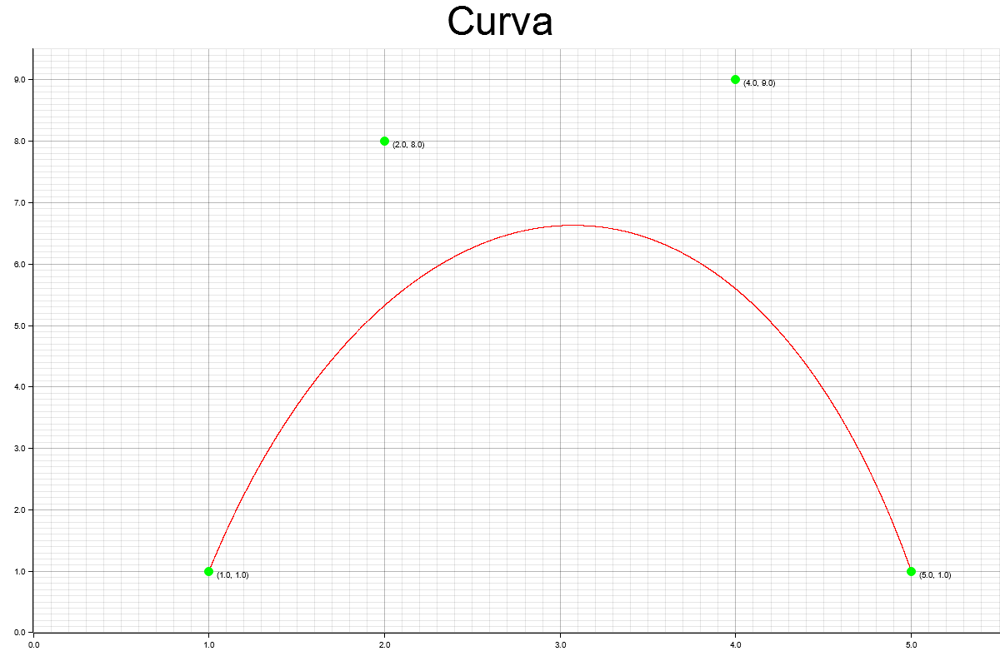

# B-Splines

Basado en la siguiente formula:

$$ C(u) = \sum_{i=0}^n N_{i,p}(u)P_i $$

Donde $N_{i,p}(u)$ es la función de base de B-Splines de grado $p$ y $P_i$ es un punto de control.

El libro en la página 82 proporciona una implementación de la función de base de B-Splines de grado $p$.

```
// ALGORITHM A3.1: 

CurvePoint(n,p,U,P,u,C) {
    // Compute curve point *1 
    1* Input: n.p.U.P.u *1 
    1* Output: C *1 
    span = FindSpan(n,p,u.U); 
    BasisFuns(span,u.p,U.N); 
    C = 0.0; 
    for (i=O; i<=p; i++) 
    C = C + N[i]*P[span-p+i]; 
}
```
Donde `FindSpan` fue definida en la página 68 y `BasisFuns` en la página 70.

## Ejemplo

Con los puntos de control:
- $P_0=(1,1)$
- $P_1=(2,8)$
- $P_2=(4,9)$
- $P_3=(5,1)$

El vector de nudos: 
$U=\{u_0=0,u_1=0,u_2=0,u_3=0,u_4=1,u_5=1,u_6=1,u_7=1\}$

Con el grado $p=3$

Y considerando que $u$ de saltos en intervalos de $0.0001$.

Se obtiene la siguiente gráfica:


