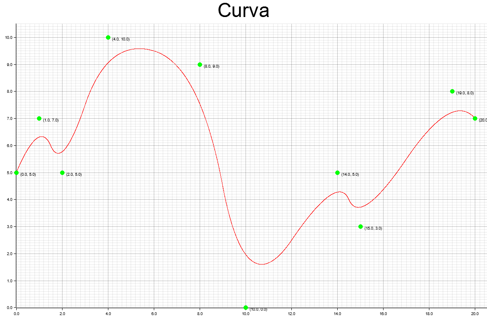

# Resultados obtenidos de las B-Splines

## Ejemplo 1
Con el vector de puntos de control $P = \{(0,5), (1,7), (2,5), (4,10), (8,9), (10,0), (14,5), (15,3), (19,8),(20,7)\}$

El vector de nodos $U = \{0,0,0,\frac{1}{8},\frac{1}{4},\frac{3}{8},\frac{1}{2},\frac{5}{8},\frac{3}{4},\frac{7}{8},1,1,1 \}$

El grado $p = 2$

Da como resultado la siguiente gráfica:

